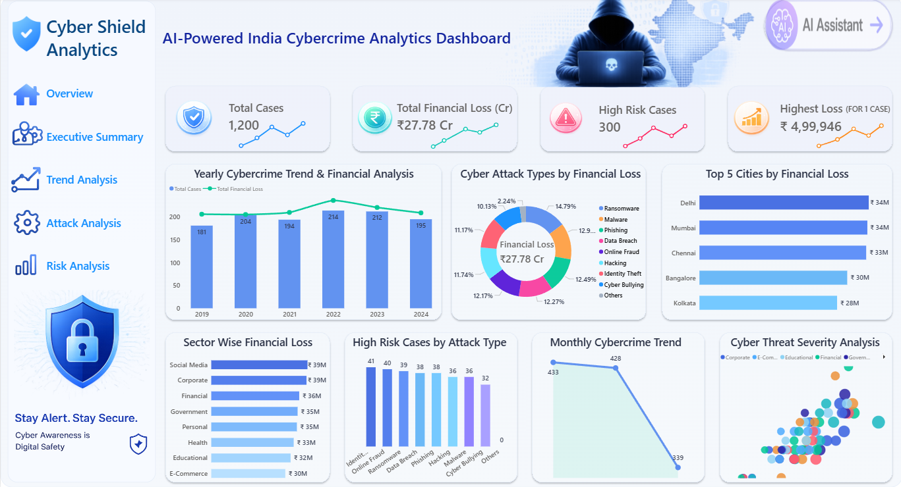

# AI-Powered Indian Cybercrime & Threat Intelligence Analytics Platform

## Cybersecurity Analytics 

An end-to-end cybercrime and threat intelligence analytics project built using Python, SQL Server, Power BI, and Streamlit AI Assistant to analyze Indian cybercrime incidents, financial losses, high-risk attack types, city-level risks, and sector-wise vulnerabilities.

---

# Dashboard Preview



---

# Project Overview

The AI-Powered Indian Cybercrime & Threat Intelligence Analytics Platform transforms raw cybercrime incident data into meaningful threat intelligence.

This project analyzes 1,200 cybercrime cases across India and helps identify:

* Cybercrime trends
* Financial loss patterns
* High-risk attack types
* City-level cybercrime impact
* Sector-wise threat exposure
* High-value cyber attacks
* AI-powered cybersecurity insights

The project follows a complete data analytics workflow from raw data cleaning to SQL analysis, Power BI dashboarding, and AI assistant integration.

---

# Business Problem

How can Indian cybercrime data be analyzed effectively to understand cyber attack patterns, financial losses, high-risk threats, and sector-level vulnerabilities?

This project helps answer:

* Which cyber attack types cause the highest financial loss?
* Which cities are most affected by cybercrime?
* Which sectors face the highest cyber threat?
* Which years show the highest cybercrime loss?
* Which attacks are classified as high-risk?
* How can users ask AI-based questions about the cybercrime dataset?

---

# Dataset Information

| Attribute      | Details                                          |
| -------------- | ------------------------------------------------ |
| Dataset Type   | Cybersecurity / Cybercrime Dataset               |
| Dataset Nature | Structured Tabular Dataset                       |
| Dataset Level  | Cybercrime Incident Level                        |
| Total Records  | 1,200 Cybercrime Cases                           |
| Main Target    | Cybercrime Trend, Risk & Financial Loss Analysis |

---

# Data Dictionary

| Column               | Description                                         |
| -------------------- | --------------------------------------------------- |
| year                 | Year in which the cybercrime case occurred          |
| day                  | Day of the month                                    |
| amount_lost_inr      | Financial loss amount in Indian Rupees              |
| incident_type        | Type of cyber attack such as ransomware or phishing |
| city                 | Indian city where the case was recorded             |
| category             | Affected sector/category                            |
| amount_lost_category | Low, medium, or high financial loss group           |
| is_high_value_attack | Binary indicator for high-risk/high-value attack    |
| day_range            | Early, mid, or late month segmentation              |
| case_date            | Generated date field for analysis                   |

---

# Tools & Technologies Used

| Tool             | Purpose                      |
| ---------------- | ---------------------------- |
| Python           | Data Cleaning & EDA          |
| Pandas           | Data Preprocessing           |
| NumPy            | Numerical Operations         |
| SQL Server       | Threat Intelligence Analysis |
| Power BI         | Dashboard Visualization      |
| Streamlit        | AI Assistant Interface       |
| Jupyter Notebook | Data Cleaning Workflow       |

---

# Project Workflow

```text
Raw Cybercrime CSV Dataset
        ↓
Python Data Cleaning & Feature Engineering
        ↓
SQL Server Threat Intelligence Analysis
        ↓
Power BI Cybercrime Analytics Dashboard
        ↓
Streamlit AI Assistant
        ↓
Cybercrime Intelligence Platform
```

---

# Python Data Cleaning Pipeline

Python and Pandas were used to clean and prepare the cybercrime dataset.

### Cleaning Steps

* Imported cybercrime CSV dataset
* Checked dataset shape, columns, and data types
* Standardized column names
* Removed duplicate records
* Cleaned text columns
* Fixed spelling and category issues
* Converted data types
* Handled missing values
* Controlled outliers using IQR method
* Created new analytical features
* Exported final cleaned dataset

### Feature Engineering

New fields created:

* `amount_lost_category`
* `is_high_value_attack`
* `day_range`
* `case_date`

Final cleaned dataset:

* 1,200 rows
* 10 columns
* Zero missing values
* Zero duplicate records

---

# SQL Server Threat Intelligence Analysis

SQL Server was used to generate structured cybercrime intelligence from the cleaned dataset.

### SQL Analysis Areas

* Total cybercrime cases
* Executive summary of financial loss
* Yearly cybercrime trend
* Attack type risk analysis
* City-level cybercrime risk
* Sector-wise cyber threat analysis
* High-risk cyber attack detection
* Monthly cybercrime pattern
* Top financial loss incidents
* Year-over-year financial loss growth

### Key SQL Insights

* Total Cases: 1,200
* Total Financial Loss: ₹27.78 Cr
* High-Risk Cases: 300
* Highest Single Loss: ₹4,99,946
* Highest Loss Attack Type: Ransomware
* Top Risk City: Delhi
* High Impact Sectors: Social Media, Corporate, Financial

---

# Power BI Dashboard Features

The Power BI dashboard was designed with a cyber-intelligence theme.

### Dashboard KPIs

* Total Cases
* Total Financial Loss
* High Risk Cases
* Highest Single Loss

### Dashboard Visuals

* Yearly Cybercrime Trend & Financial Analysis
* Cyber Attack Types by Financial Loss
* Top 5 Cities by Financial Loss
* Sector-Wise Financial Loss
* High-Risk Cases by Attack Type
* Monthly Cybercrime Trend
* Cyber Threat Severity Analysis

---

# AI Assistant Explanation

This project includes an AI-powered assistant called **CyberInsight AI Assistant**.

The AI assistant was built using Streamlit and acts as an interactive question-answering layer for the cybercrime analytics project.

## AI Assistant Features

* Understands cybercrime-related questions using natural language input
* Provides intelligent insights from cybercrime analytics data
* Identifies high-risk attack patterns and cyber threat trends
* Supports interactive cybersecurity intelligence analysis through AI
* Shows quick insights such as top risk city, top attack type, and highest loss year
* Allows users to ask cybercrime-related questions
* Helps users understand the dataset without manually reading every chart
* Can be extended using Gemini, Groq, OpenRouter, or local Pandas-based responses

## AI Assistant Screenshot Link

[CyberInsight AI Assistant Screenshot](cyberinsight_ai_assistant.png)

---

# Key Findings

* Ransomware caused the highest financial damage
* Delhi, Mumbai, and Chennai were among the highest-risk cities
* Social Media and Corporate sectors showed major financial impact
* 2022 recorded the highest financial loss
* Early and mid-month periods showed higher cybercrime activity
* AI assistant improves the project by adding an interactive insight layer

---

# Repository Structure

```text
AI-Powered-Indian-Cybercrime-Analytics/
│
├── dataset/
│   └── cybersecurity_cases_india_combined.csv
│
├── notebook/
│   └── cybercrime_data_cleaning_pipeline.ipynb
│
├── sql_queries/
│   └── cybercrime_analytics_Insights.sql
│
├── powerbi_dashboard/
│   └── AI Cybercrime Threat Intelligence Dashboard.pbix
│
├── report/
│   └── Report_AI_Cybercrime_Project_Report.pdf
│
├── presentation/
│   └── AI-Powered-Indian-Cybercrime-and-Threat-Intelligence-Analytics-Platform.pdf
│
├── screenshots/
│   ├── Ai_powered_india_cybercrime_analytics_dashboard.png
│   └── cyberinsight_ai_assistant.png
│
├── README.md
├── LICENSE
└── .gitignore
```

---

# Future Scope

* Real-time cybercrime data feeds
* Machine learning-based attack prediction
* Anomaly detection for high-loss cases
* Threat intelligence API integration
* Natural language SQL generation
* Online deployment of Streamlit AI Assistant
* Power BI web integration

---

# Disclaimer

This project is created for educational and portfolio purposes only. The dataset used in this project is for analytics, learning, and cybersecurity awareness demonstration.

---

# Author

## Miryala Yashwanth

* Python
* SQL Server
* Power BI
* Streamlit
* Data Analytics
* Cybersecurity Analytics
